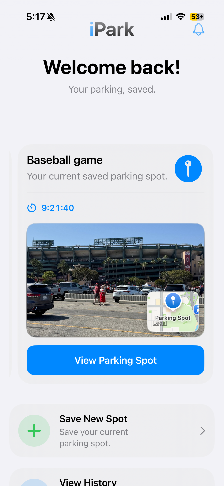
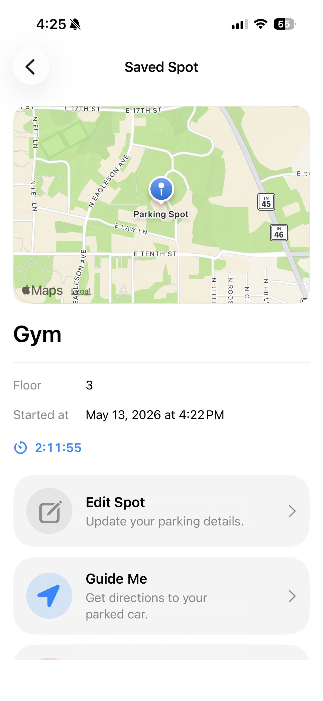
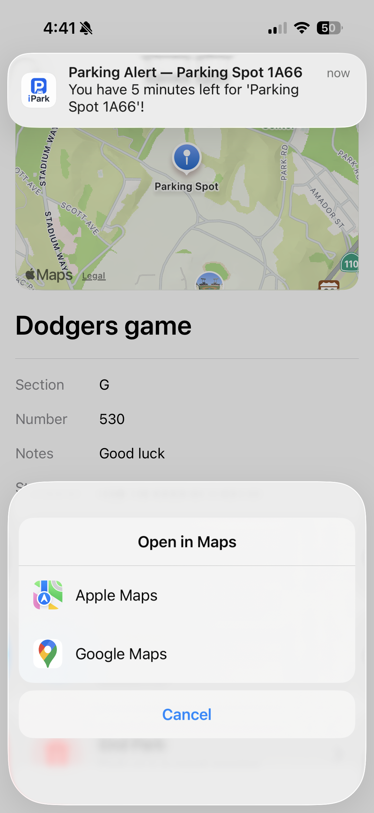
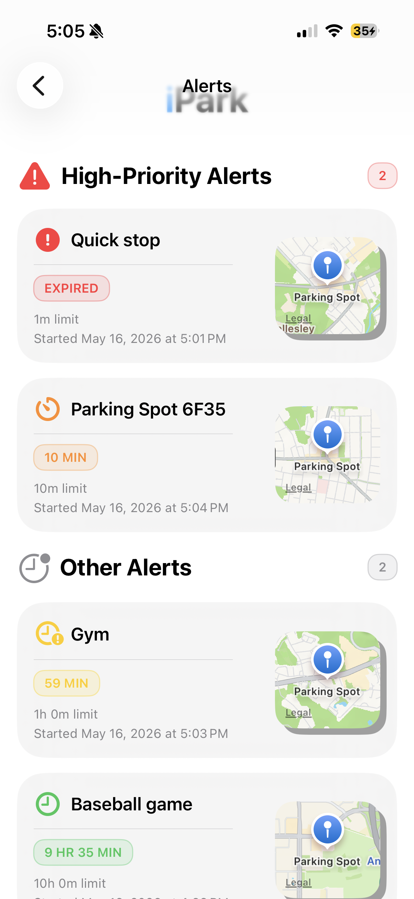
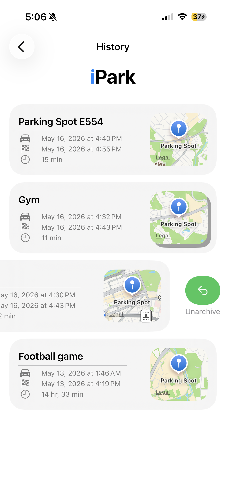

# iPark

A native iOS app for saving, managing, and navigating back to your parked car.

---

## Screenshots

<p align="center">
  
  
  
  
  
  
</p>

---

## Features

- **Save your spot** — capture your parking location with a map pin or your current GPS location
- **Spot details** — log floor, section, number, and notes for garage parking
- **Time limits** — set a time limit and receive push notifications at 15, 10, and 5 minutes remaining, plus an expiry alert
- **Guide Me** — open directions to your parked car in Apple Maps or Google Maps
- **Alerts tab** — view active spots sorted by urgency, with high-priority warnings for spots expiring soon
- **History** — browse past parking sessions with duration and location details
- **Delete & unarchive** — swipe left to permanently delete a past session, or swipe right to restore it to active
- **Quick Look** — tap any spot for an at-a-glance overlay of its essential details

---

## Requirements

- iOS 17.0+
- Xcode 16+
- A physical device is recommended for GPS and Notifications features

---

## Installation

1. Clone the repository
   ```bash
   git clone https://github.com/Yk231/iPark.git
   ```
2. Open `iPark.xcodeproj` in Xcode
3. Select your target device or simulator
4. Build and run

No external dependencies or package manager setup required.

---

## Permissions

| Permission | Purpose |
|---|---|
| Location (When In Use) | Saving your parking location and navigating back to your car |
| Notifications | Time limit alerts as your parking session approaches expiry |

---

## Tech Stack

| Functionality | Framework |
|---|---|
| UI | SwiftUI |
| Persistence | Core Data |
| Location | CoreLocation |
| Maps | MapKit |
| Notifications | UserNotifications |

---

## Known Limitations

- GPS accuracy degrades significantly in parking garages — the app will let you drop a pin manually as a fallback
- The app saves spots you have already parked in. It does not predict or show available street or garage parking

---

## Credits

Developed by [Yotam Krikov](https://github.com/Yk231)
